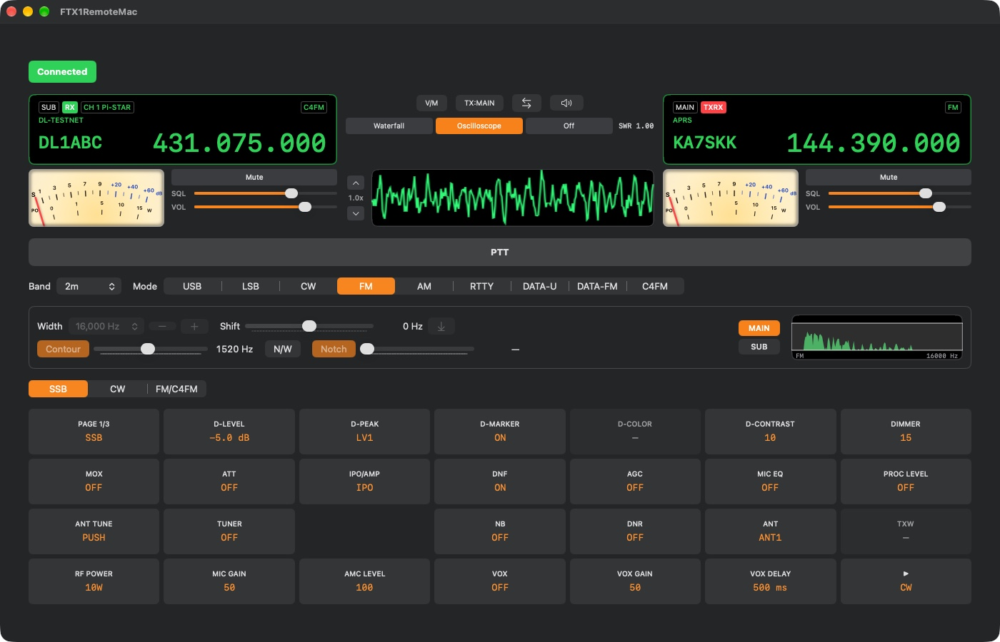

# FTX1Remote



Native app suite to remotely control and monitor a Yaesu FTX-1 amateur radio
transceiver — a Mac hub app plus iOS, iPadOS, and Windows clients — built
because the radio lives at home on USB and this makes it usable from the
desk or from anywhere over Tailscale, without needing hamlib's
`rigctld_control.py` or a physical presence next to the rig.

Single-user tool: no multi-user auth/permissions model.

`Sources/FTX1Core/` is the shared Swift package (`FTX1Core`) consumed by the
Mac, iOS, and iPadOS targets. The Windows client shares no code with it
(Swift/SwiftUI isn't viable there) but mirrors its shape in C#.

## Architecture

- **Mac app is the hub.** It's the only thing that talks to hardware
  (directly, or over the network to a Pi — see below). It owns the
  `RigctldClient` connection to rigctld (hamlib), holds live rig state, and
  runs `RigWebSocketServer` (`Network.framework`'s `NWListener` +
  `NWProtocolWebSocket`, since `URLSessionWebSocketTask` is client-only)
  that broadcasts state and accepts commands from mobile clients.
- **rigctld runs locally on the Mac or remotely on a Raspberry Pi**
  (`RigctldSettings.connectionMode`, `.local`/`.remote`) — the radio's
  USB/serial cable may be plugged into either machine, and both modes are
  fully supported side by side, not a one-way migration.
  - `.local`: the Mac spawns/adopts rigctld itself
    (`RigctldProcessController`) against `localhost:4532`, adopting an
    already-running, responsive instance on launch rather than killing it
    (another client, e.g. WSJT-X, may be mid-session with it) — only a
    stale/unresponsive one gets replaced.
  - `.remote`: connects to rigctld already running on a Pi
    (`<remoteHost>:4532`, a Tailscale MagicDNS hostname) and skips process
    management entirely.
  - Everything downstream (WebSocket server, `CommandQueue`, state push) is
    unchanged between modes. Switching modes requires an app relaunch
    (`RigctldClient`/`CommandQueue` are resolved once at launch).
  - Hardware-confirmed working in both modes. Still open: distinguishing
    "Pi/Tailscale unreachable" from "rigctld/radio down but the Pi is fine"
    in `.remote`'s connection-state UI — both currently surface as one
    generic failed state.
- **Mobile apps never talk to rigctld directly.** iOS/iPadOS use
  `RigWebSocketClient` (via the shared `RigClientViewModel`) to connect to
  the Mac over Tailscale. The iPhone app (`Apps/iOS/FTX1RemoteiOS`) is a
  focused single-rig-control view (frequency, SWR, PTT, mode grid) — no
  attempt to mirror the Mac's dense layout, and no numbered MENU grid yet.
  The iPad app (`Apps/iPad/FTX1RemoteiPad`) is a separate Xcode target
  (deliberately not a universal/size-classes target) that *does* mirror the
  Mac's dense layout — VFO A/B side by side, SWR/PTT/power/band/mode, plus
  the numbered MENU grid — sharing UI with the Mac via a `RigController`
  protocol rather than duplicating files. Deep Settings is Mac-only on
  every mobile target, iPad included (see below for why); iPad's FM page
  shows a disabled "SOON" placeholder for those 6 buttons instead.
- **The Mac's own local UI calls `HubService` directly**, not through
  `RigWebSocketClient` round-tripping to itself — every Mac feature built
  so far uses this direct path, and `HubService` still broadcasts every
  applied command to remote clients regardless of how it was triggered. The
  WebSocket path is exercised by remote (iOS/iPad) clients only today.
- **State sync is push-based.** The Mac broadcasts a `RigStatePush`
  whenever rigctld reports a change (VFO, mode, power, SWR, PTT, the
  numbered MENU grid's fields); clients don't poll. Deep Settings values
  are fetched on-demand instead, not part of this broadcast — the wire
  protocol has no general request/response mechanism, only fire-and-forget
  `RigCommand` and one-way `RigStatePush`.
- **Commands are serialized** through `CommandQueue` on the Mac side, since
  rigctld handles one request/response cycle at a time.
- **A software transmit-safety interlock gates every outgoing command.**
  `HubService`'s `enableTransmit` toggle (surfaced in Settings) blocks
  anything that could key the radio, checked centrally at
  `HubService.send(...)` rather than scattered per-command. Not yet
  ported to the Windows client.
- **Two menu systems, both driven by raw CAT passthrough** — most FTX-1
  menu items have no hamlib func/level equivalent, per the CAT Operation
  Reference Manual:
  - The numbered **MENU grid** (`MenuPageView`, shared UI, `Sources/
    FTX1Core/UI/`) — one `RigCommand` case, `RigState` field, and
    hand-written button per item, wired individually as needed. Generic
    over `RigController` so it's driven by either `HubService` (Mac) or
    `RigClientViewModel` (mobile) without duplicating the file per target.
    The FM/C4FM page is fully wired (every item live, hidden, or
    deliberately disabled); the rest of the grid is wired incrementally —
    see `MenuPageView.swift` for current coverage.
  - The page-3 **Deep Settings** screens (`DeepSettingsView`, Mac-only) —
    Radio/CW/Operation/Display/Extension/APRS Setting, addressed via the
    "EX" CAT command's P1/P2/P3 category/tab/item scheme. Driven generically
    by `DeepSettingsCatalog` (table-driven, ~250+ items across all six
    categories) plus one generic `RigCommand` case and one `RigctldClient`
    method pair (`getMenuItem`/`setMenuItem`) — adding an item is a catalog
    entry, not new code. Unavailable on mobile: it needs
    `HubService.readMenuItem`, a live per-item read only the Mac's direct
    rigctld link supports.
  - The manual has been wrong often enough (wrong labels, wrong digit
    widths, at least one wrong value mapping) that new entries in either
    system get read from the manual directly and hardware-tested, never
    assumed from another Yaesu rig's conventions.
- **The waterfall/oscilloscope display is audio-derived, not CAT-derived**
  (`AudioCaptureEngine`, Mac-only): an FFT over raw audio samples producing
  both a scrolling waterfall and an oscilloscope trace, entirely separate
  from the rig-control data path — no rigctld or wire-protocol involvement,
  and the display itself isn't broadcast to mobile (only the raw audio is,
  to iPad). Auto-gain via peak-hold-and-decay rather than a fixed range.
  Where the audio comes from follows the same `connectionMode` as rig
  control: `.local` taps a user-selected Mac Core Audio input; `.remote`
  streams from the Pi (`Pi/ftx1-audiostream.py`, raw TCP, 44100Hz — raised
  from an initial 8kHz once that proved too coarse for reliable APRS AFSK
  timing) via `RemoteAudioStreamClient`. Both feed the exact same
  downstream FFT/relay code, which also gates APRS decoding and drives Mac
  playback/squelch.
- **APRS decoding runs entirely in-app**, since CAT exposes no
  received-station/message data: `AFSKDemodulator`/`AX25Frame`/
  `APRSPacket` (`Sources/FTX1Core/APRS/`) decode the same raw audio tap the
  waterfall uses, gated to when APRS is enabled and the VFO is within
  `APRSSettings.toleranceHz` of the configured calling frequency.
  `APRSStore` keeps decoded station/message history (persisted to disk as
  a single JSON snapshot, the app's only persistence layer), shown in the
  Mac-only S.LIST/M.LIST windows (`APRSStationListView`/
  `APRSMessageListView`). Squelch itself is quieting-based (gates on FM
  quieting dips, not raw amplitude) — confirmed working against real FM
  and APRS traffic.
- **Optional WPSD hotspot integration** (`WPSDSettings`/
  `WPSDCallsignMonitor`, Mac-only, C4FM tab in Settings): polls a
  Pi-Star-family hotspot dashboard's HTML (undocumented, unauthenticated —
  no API exists) to show the callsign currently transmitting and the linked
  YSF reflector name for C4FM/YSF traffic relayed through it, since no CAT
  command exposes either.
- **Windows app is a separate, remote-only client**
  (`Apps/Windows/FTX1RemoteWindows/`, C# + WinUI 3, MSIX-packaged) that
  talks directly to the Pi's rigctld and `ftx1-audiostream.py` — never
  through the Mac hub, and the Mac doesn't need to be running. v1 scope is
  core rig control only (VFO A/B, mode, PTT, power, SWR, band); MENU grid,
  Deep Settings, waterfall/audio, and APRS are deferred but not
  architecturally blocked (direct-to-Pi gives it the live per-item read
  Deep Settings needs, unlike iPad). Build-verified, not yet run against
  real hardware. See `Apps/Windows/README.md`.
- **High-rate state (audio frames, meter samples) stays off `HubService`'s
  `@Published` surface.** `HubService` is what nearly every Mac view
  observes, so anything published there re-renders the whole window; scope
  frames instead live in a small dedicated `ScopeFrameStore` observed only
  by `ScopeDisplayView`. Follow the same pattern for any future high-rate
  state.

## Module layout

```
Sources/FTX1Core/
├── RigState/       RigState, RigMode, BandPlan, HomeFrequency — shared
│                    state model, band table, home-frequency setting
├── Appearance/      AppTheme, ButtonValueColor, AppearanceSettings — shared
│                    app-appearance settings (theme, MENU grid button color)
├── Networking/      WireMessage (JSON protocol: RigCommand/RigStatePush),
│                    RigctldClient (Mac-only, TCP to rigctld, incl. raw CAT
│                    passthrough), RigWebSocketClient (WS client, used by
│                    mobile — see Architecture above re: the Mac's own UI),
│                    RigClientViewModel (ObservableObject wrapping
│                    RigWebSocketClient, shared by iOS + iPad)
├── Commands/        CommandQueue — serializes RigCommands into rigctld calls
├── MenuSettings/    DeepSettingsCatalog — static, table-driven catalog
│                    behind the Deep Settings screens (see Architecture)
├── Audio/           AudioStreamFormat (Mac→iPad wire format), SquelchGate
│                    (quieting-based squelch), AudioPlaybackEngine/
│                    AudioPlaybackSettings — shared so iPad can play the
│                    relayed audio too, even without the Mac's slider UI
├── APRS/            AFSKDemodulator, AX25Frame, APRSPacket, APRSModels —
│                    the decode pipeline itself (platform-agnostic DSP/
│                    parsing); the Mac-only UI/store consuming it lives in
│                    the Mac app target (see below)
└── UI/              RigController (protocol HubService/RigClientViewModel
                     both conform to), MenuPageView (numbered MENU grid,
                     shared by Mac + iPad), VFODisplayBox + FrequencyEntryView
                     + MemoryChannelEntryView (VFO readout, tap-to-edit
                     frequency entry, and memory-channel entry, shared by
                     Mac + iPad), SMeterView (analog S/SWR meter face,
                     shared by Mac + iPad)
```

Mac-only, not part of the shared package (`Apps/Mac/FTX1RemoteMac/`):
`AudioCaptureEngine`/`AudioInputDevice`/`AudioOutputDevice` (Core Audio I/O
and the FFT that drives the waterfall/oscilloscope), `ScopeDisplayView`,
`RemoteAudioStreamClient` (the `.remote` audio path to the Pi),
`APRSDecoder`/`APRSStore`/`APRSPersistence`/`APRSStationListView`/
`APRSMessageListView` (the APRS feature's Mac-side wiring and UI),
`WPSDSettings`/`WPSDCallsignMonitor` (hotspot callsign/reflector lookup),
`BandMemory` (per-band last-frequency recall), `RigctldProcessController`,
`RigWebSocketServer`, `HubService`/`HubService+RigController`, `ContentView`,
`SettingsView`, `DeepSettingsView`. None of these are wired into the wire
protocol or `RigController`, so they aren't shared with mobile targets the
way the rest of this layout is.

`Apps/Windows/FTX1RemoteWindows/` (C# + WinUI 3) shares no code with
`FTX1Core` but is architecturally closest to the Mac permanently in
`.remote` mode, minus process management and the WebSocket server. See
`Apps/Windows/README.md`.

`Pi/` holds the deployable Pi-side pieces (`ftx1-audiostream.py` + its
systemd unit) — not part of any Xcode target; deploy per `Pi/README.md`.
`rigctld.service`/`direwolf.service` (the Pi's other two systemd units, the
latter coexisting with `ftx1-audiostream.py` on the same capture device via
an ALSA `dsnoop` share) are set up directly on the Pi, not tracked here.

## Mac app at a glance

Single dense multi-pane window (no menu bar extra): VFO A/B, S/SWR meter,
waterfall/oscilloscope with volume/squelch sliders, band/mode selectors, and
the numbered MENU grid all visible at once. A tabbed Settings sheet covers
rigctld connection (Local/Remote mode), Audio (input/output device
pickers), C4FM (WPSD hotspot lookup), APRS (enable, frequency/tolerance,
retention limits), Home Freq, and Appearance. Deep Settings opens as a
separate window from the MENU grid's page-3 items. APRS station/message
history opens in its own S.LIST/M.LIST windows. Real control happens here
as well as from mobile — the Mac isn't monitor-only.

## Not yet built / open

- A wire-protocol request/response mechanism for Deep Settings reads on
  mobile — blocks bringing `DeepSettingsView` to iOS or iPad; iPad's Deep
  Settings buttons show a "SOON" placeholder until this exists.
- iOS UI for the numbered MENU grid (iPad has it; iOS doesn't yet).
- Full state diffing / reconnect-and-resync logic for `RigWebSocketClient`.
- The numbered MENU grid is still growing outside the completed FM/C4FM
  page — see `MenuPageView.swift` for current per-item coverage (some
  buttons are wired, some are deliberately disabled placeholders pending
  hardware issues, the rest are unwired).
- "Pi/Tailscale unreachable" vs. "rigctld/radio down but the Pi is fine" is
  not yet distinguished in `.remote` mode's connection-state UI.
- Windows app v1 is a build-verified skeleton not yet run against real
  hardware, and doesn't have the transmit-safety interlock the Mac has.
- WSJT-X's "Hamlib NET rigctl" setup must be pointed manually at whichever
  host is active (localhost in `.local`, the Pi in `.remote`) — not managed
  by this app.
- Deep Settings gaps: RADIO SETTING's WIRES-X tab (postdates the CAT
  manual's firmware revision, no source yet), KEY/DIAL's MIC UP/MIC DOWN
  (shape unknown, deliberately deferred), and the manual's P1=09 "PRESET"
  category (out of scope until a page-3 button is decided to map to it).
- Dual-VFO audio is mono end-to-end despite the FTX-1 confirmed outputting
  stereo Main/Sub — deferred future feature.
- Memory→VFO mode toggle has a hub-side workaround for a stuck-frequency
  bug (replays FA/MD after switching); root cause still unknown.

## Commands

- Build/test the shared package: `swift build`, `swift test` (from repo
  root — `Package.swift` covers only the `FTX1Core` library + test target).
- Build an app target: `xcodebuild -project
  FTX1RemoteMac/FTX1RemoteMac.xcodeproj -scheme
  <FTX1RemoteMac|FTX1RemoteiOS|FTX1RemoteiPad> -destination
  '<platform=macOS|generic/platform=iOS Simulator>' build` — not
  `swift build`, which doesn't cover the app targets at all.
- Run the Mac app: `open` the built `.app` under
  `~/Library/Developer/Xcode/DerivedData/FTX1RemoteMac-*/Build/Products/Debug/`,
  or Cmd+R in Xcode.
- Build the Windows app: from `Apps/Windows/FTX1RemoteWindows/`, `dotnet
  build -r win-x64 --self-contained` (or open the `.csproj` in Visual
  Studio) — separate toolchain, not part of `Package.swift`/`xcodebuild`.

See the repo root `CLAUDE.md` for full design rationale, status history,
and working conventions.
